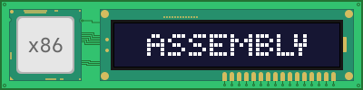
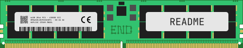

# x86 Assembly Notebook

The x86 Assembly Notebook is a guide for the assembly programming languages used by the x86 family of computer processors.

## Table of contents
  - [Chapter 1: Foreword](/doc/en/chapter01.md)
    - [1.1. About The x86 Assembly Notebook](/doc/en/chapter01.md#11-about-the-x86-assembly-notebook)
    - [1.2. Intended Audience](/doc/en/chapter01.md#12-intended-audience)
    - [1.3. Copyright Notice](/doc/en/chapter01.md#13-copyright-notice)

## TO-DO
  - [ ] Chapter 2: Basics
  - [ ] chapter 3: Environment

 

