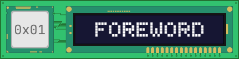
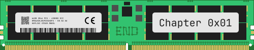

# Chapter 1: Foreword

### 1.1. About The x86 Assembly Notebook

The x86 Assembly Notebook is a guide for the assembly programming languages used by the x86 family of computer processors.

The reason this guide is called a "notebook" is because it reflects my journey learning the principles of the assembly programming languages and is written at the same time I'm learning, like a notebook.

Since I'm learning assembly by teaching it (Feynman Technique), I will try to explain the concepts in the simplest way possible and make use of alternative resources for teaching (eg. illustrations, animations). 

It should be taken into account that I do not have an academic background in the tech industry. I'm an 11th grade high schooler studying theology and English is not my primary language.

This means that the notebook is prone to spelling or grammar mistakes and technical inaccuracies, so do not hesitate to communicate or open an Issue on GitHub when you find a mistake.

### 1.2 Intended Audience

The explanations in this notebook are written in such a way that it does not take much prior knowledge in the field to understand the basic concepts.

This guide is geared towards any computer enthusiast who wants to understand how things work under the hood.

If you have any problems understanding some of the concepts here, open an Issue on GitHub.

### 1.3 Copyright Notice

All the documentation, source code and assets available in this repository are under the BSD-2-Clause license.

 

